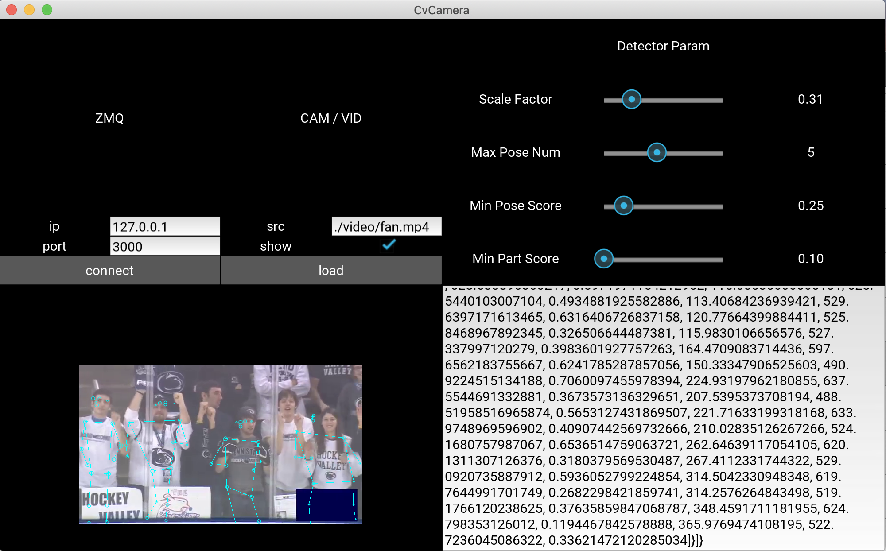

# Pose Detection with Zmq

## 環境
- Mac 10.14.4
- Python 3.7.3

## python packages
- `requirments.txt`

## インストール
1. clone this repository
2. `python3 -m venv ZMQ_PAGE_ENV` (ZMQ_PAGE_ENVの部分は任意)
3. `source activate ZMQ_PAGE_ENV/bin/activate`
4. `pip install -r requirments.txt`

## 実行
1. `source POZE_ZMQ_ENV/bin/activate`
2. `python main.py` (最初の実行はモデルをインストールするため、時間かかる)
終わるときは
3. `deactivate`

## GUI

1. 上左
    - ZMQ settings
    - connectボタンで再接続 
        - プログラム実行時デフォルトで、"127.0.0.1" "3000" に接続

2. 上中
    - Camera / Video settings
    - src
        - カメラの場合 : srcの番号を入れる. 
        - ビデオの場合 : パスを入れる
        - TextInputにはデフォルトで、動画ファイルのパスが入っている
    - loadボタンで自動で切り替わる
        - デフォルトで、カメラ（ソース：0）が起動する
  
    - Showのトグルスイッチ
        - 切り替えによって、カメラ表示/非表示切り替え

3. 上右
    - Posenet Parameter
    - Scale Factor
        - 画像をどのくらい小さくして処理するか
        - 大きいほど遅いが、小さすぎると精度減
    - Max Pose Num
        - 認識する人の最大数
        - 1~10
    - Min Pose Score
        - ポーズのスコアの閾値
    - Min Part Score
        - ポーズの部位のスコアの閾値

4. 左下
    - 処理後の画像表示

5. 右下
    - zmqで送っているjsonデータを表示

## ファイル説明
- `main.py`
    - 実行ファイル
    - GUI event handle
- `main.kv`
    - style file
    - evnetbind setting
- `data_send.py`
    - zmq protocol handler
- `detection.py`
    - pose detector
- `video`
    - 動画ファイルを入れるフォルダ